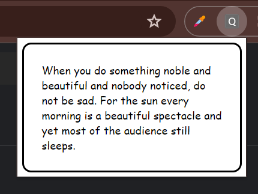

# Quotes Chrome Extension

The Quotes Chrome Extension is a simple extension that displays random quotes when activated. It's a great way to get inspired or motivated with just one click!

## Features

- Displays a random quote every time the extension is activated.
- Easy-to-use interface with minimalistic design.
- Lightweight and fast performance.

## Installation

To install the Quotes Chrome Extension, follow these steps:

1. Download the extension files from the repository.
2. Go to (https://rapidapi.com/martin.svoboda/api/quotes15/) and get your API key and host address.
3. Go to script.js file and replace the key and address.
4. Open Google Chrome and navigate to `chrome://extensions`.
5. Enable Developer Mode by toggling the switch in the top right corner.
6. Click on the "Load unpacked" button and select the folder containing the extension files.
7. The Quotes Chrome Extension should now be installed and visible in your Chrome browser toolbar.

## Usage

To use the Quotes Chrome Extension, follow these steps:

1. Click on the extension icon in the Chrome browser toolbar.
2. A random quote will be displayed in a popup window.
3. Click the "Refresh" button to get a new random quote.

## Feedback and Contributions

Feedback and contributions are welcome! If you encounter any issues, have suggestions for improvements, or would like to contribute to the project, please feel free to [open an issue](https://github.com/WebDevHarsha/Chrome-Extensions/issues) or [create a pull request](https://github.com/WebDevHarsha/Chrome-Extensions/pulls).

## Acknowledgements

- The Quotes Chrome Extension utilizes the [Quotes API](https://rapidapi.com/hub) to fetch random quotes.

---

Replace the placeholders with the appropriate information about your extension. Make sure to include installation instructions, usage guidelines, and information about how users can contribute to the project. Additionally, if your extension uses any external APIs or libraries, acknowledge them in the README file.

Feel free to customize the README file further based on the specific features and requirements of your Chrome extension!

---

<h1>Example:</h1>

